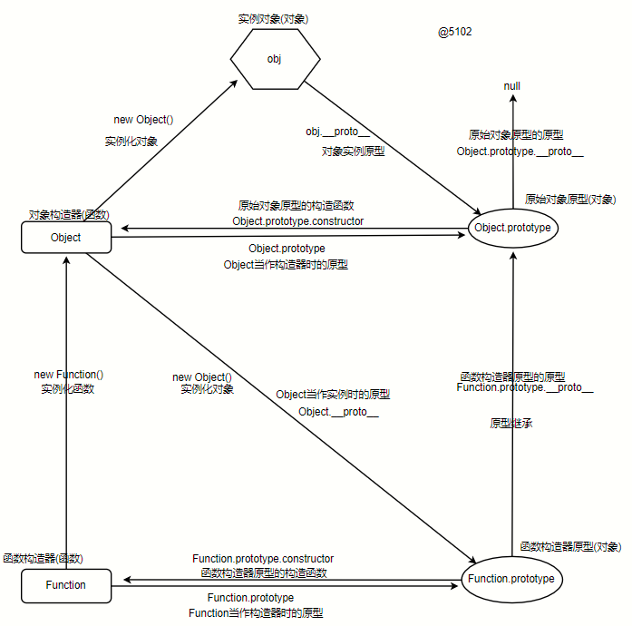

# 原型与原型链

## 什么是javaScript的原型？

在规范里，`prototype`被定义为给其它对象提供共享属性的对象，`prototype`描述的是两个对象之间的某种关系（其中一个，为另一个提供属性访问权限）。规范中明确描述了所有对象，都有一个隐式引用，它被称之为这个对象的 prototype 原型。

### 1. ECMAScript 规范说 prototype 应当是一个隐式引用，目前有两种访问规则

1. 通过 Object.getPrototypeOf(obj) 间接访问指定对象的 prototype 对象，通过 Object.setPrototypeOf(obj, anotherObj) 间接设置指定对象的 prototype 对象。
2. 部分浏览器提前开了 __proto__ 的口子，使得可以通过 obj.__proto__ 直接访问原型，通过 obj.__proto__ = anotherObj 直接设置原型。ECMAScript 2015 规范只好向事实低头，将 __proto__ 属性纳入了规范的一部分

### 2. 手动实现一个__proto__属性(对象原型)

> 对象的属性并非ECMAScript的标准，而是由于早起无法获得对象原型即对象内部属性```[[prototype]]```, 所以各大浏览器厂家使用```Object.prototype```
> 通过访问描述符实现```__proto__```的getter和setter来达到访问调用对象的```[[prototype]]```属性
> ```[[prototype]]```属性属于对象的内部属性无法直接访问，此属性指向对象原型

```__proto__```的大致实现

```js
Object.defineProperty(Object.prototype, '__proto__', {
    set: function (o) {
        Object.setPropertyOf(this, o) // 设置引用对象[[Prototype]]属性关联的原型为o
        return o
    },
    get: function () {
        return Object.getPropertyOf(this) // 获取引用对象的[[Prototype]]
    }
})
```

## 2. 函数的prototype属性

> 所有函数都有的```prototype```属性，js中函数也属于对象的一个子类型，所以函数也具有```__proto__```与普通对象类似都指向其原型
> 而这里的```prototype```属性是函数特有的
> 但函数使用new操作进行修饰时，我们可以理解为该函数被当做构造函数使用也就是构造器，当函数被当作构造函数时，其```prototype```就起了作用
> 使得由```new操作符修改的构造函数创建```的出来的```对象```的```__proto__```属性指向```构造函数```的```prototype```

```js
function Parent () {
    console.log('aaaa')
}
const child = new Parent()

console.log(child.__proto__ === Parent.prototype)
console.log(Parent.prototype.__proto__ === Object.prototype)

```

为了便于讲解，这里将函数的```prototype```属性称呼为```构造器原型```以便接下来的讲解。

+ 这里要区分函数的```__proto__```属性是作为对象时关联的原型即对象原型

+ 函数的```prototype```作为构造函数调用时关联的原型即构造器原型
  
这里要先弄清楚其中的区别，以便接下来的讲解

## 3. 各类方法与属性的统称

> 构造函数当中定义的方法叫做```静态方法```，构造函数当中定义的属性叫做```静态属性```
> 在原型当中定义的方法叫做```原型方法```，在原型当中定义的属性叫做```原型属性```
> 实例中的```属性```以及```方法```，我们也就称呼为```实例属性/方法```
> 当然方法也属于属性，只是我们通常把定义在对象中的函数称为方法

1. 原型

+ 只有对象类型的才有原型的概念
+ ```普通对象```（即使用对象字面量或者Object构造器创建的对象）的```原型```为```__proto__```，这个属性其实就是一个构造器属性，并不是真实存在的属性，可以使用```Reflect.getPropertyOf(obj)```或者```Object.getPropertyOf(obj)```获得对象的原型。其关系主要是```Reflect.getPropertyOf({}) === Object.getPropertyOf({}) === {}.__proto__```
+ ```普通函数```有两个属性，一个是```__proto__```属性与普通对象类似，还有一个是函数的独有属性```prototype```，因为函数有双重身份，既是```实例```也可以是```构造器```
+ 不是所有的```对象```都会有```原型```，比如对象原型```Object.prototype```的原型```Object.prototype.__proto__```就指向```null```，字典对象的原型也为```null```(把对象的__proto__设置为null，或者使用Object.create(null)创建一个```没有原型```的```字典对象```，但是这个对象还是属于```对象类型```)，所以```原始对象原型(Object.prototype)```就是最原始的原型，其他对象类型都要继承自它。
+ 箭头函数虽然属于函数，由Function产生， 但是没有```prototype```属性```没有构造器特性```，所以也就没有所谓的```constructor```，就不能作为```构造器```使用

2. 原型链

这里会详细介绍原型、原型链、实例、构造器的关系 先看最原始的关系



```js
// Object
Object.__proto__ === Function.prototype
Object.__proto__.constructor === Function
Function.prototype.__proto__ === Object.prototype
Object.prototype.__proto__ === null
Object.prototype.constructor === Objct

const obj = new Object()

obj.__proto__ === Object.prototype
obj.__proto__.constructor === Object

console.log(Function.prototype.__proto__.constructor.__proto__.constructor === Function)
```

+ 所有函数都是由Function函数构造器实例化而来
+ 所有实例的原型都指向构造它的构造器的prototype
+ 每个构造器自身特有的方法就是静态方法，原型上的方法可供所有继承它或间接继承它的实例使用
+ 构造器也是函数，也是被Function实例化出来的，所以构造器的__proto__就是Function，但是构造器的prototype属性指向的原型，是此构造器实例化出来的实例所指向的原型；简单说构造器的prototype就是作为它的实例的原型


```js

function A () {}
const b = new A ()
// 此时函数A作为普通函数
A.__proto__ === Function.prototype
A.__proto__.constructor === Function
A.prototype.__proto__ === Object.prototype
A.prototype.__proto__.constructor === Object

// 此时函数A作为构造函数实例化对象
b.__proto__ === A.prototype
b.constructor === A

// 此时C是通过原始函数的构造函数函数构造出来的实例
const C = new Function () {}

C.__proto__ === Function.prototype
C.__proto__.constructor === Function

```

+ 在js中```函数```有多重身份，函数可以作为```类```就是```构造器```使用，定义静态方法，作为```普通函数调用```，
+ 只有由```原始函数构造器(Function)```实例化的函数才拥有直接使用```函数原型```(Function.prototype)上面的内置方法，```创建函数只能通过原始函数构造器生成```，
+ ```普通函数```作为```构造器```使用```(new)```时相当于```类(class)```使用，类的```prototype```就是实例的原型，我们可以给```原型```添加属性，给```类```添加属性时就相当于给```构造器```添加静态属性
+ ```普通函数在创建实例```的时候，会生成一个```实例```的```原型```，此```原型```指向```Object.prototype```即```原始对象原型```，也就是```继承对象原型```，这么一来```实例也继承了对象的原型，则实例也属于对象类型```


## 面试题：

1. 为什么 typeof 判断 null 是 Object 类型？

因为Object.prototype指向null，而javaScript的原型描述的是两个对象之间的某种关系（其中一个，为另一个提供属性访问权限），所以这是对象和对象之间的关系，所以typeof 判断 null 是 Object 类型

2. Function 和 Object 是什么关系？
   
3. new 关键字具体做了什么？手写实现。
4. prototype 和__proto__是什么关系？什么情况下相等？
5. ES5 实现继承有几种方式，优缺点是啥
6. ES6 如何实现一个类
7. ES6 extends 关键字实现原理是什么
