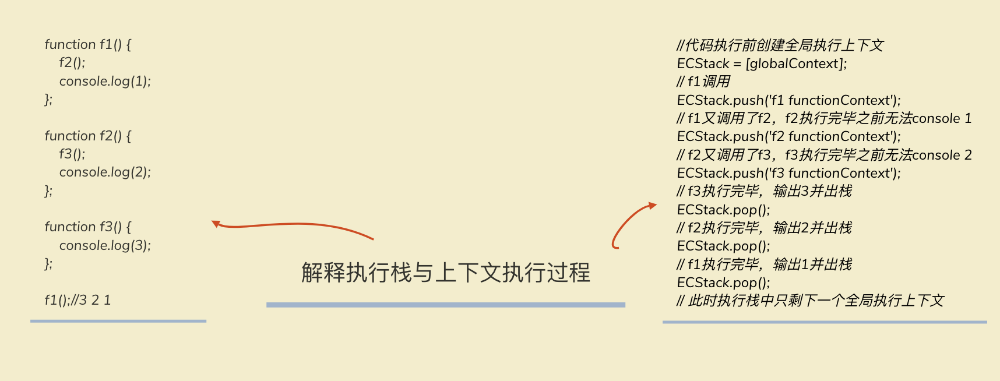
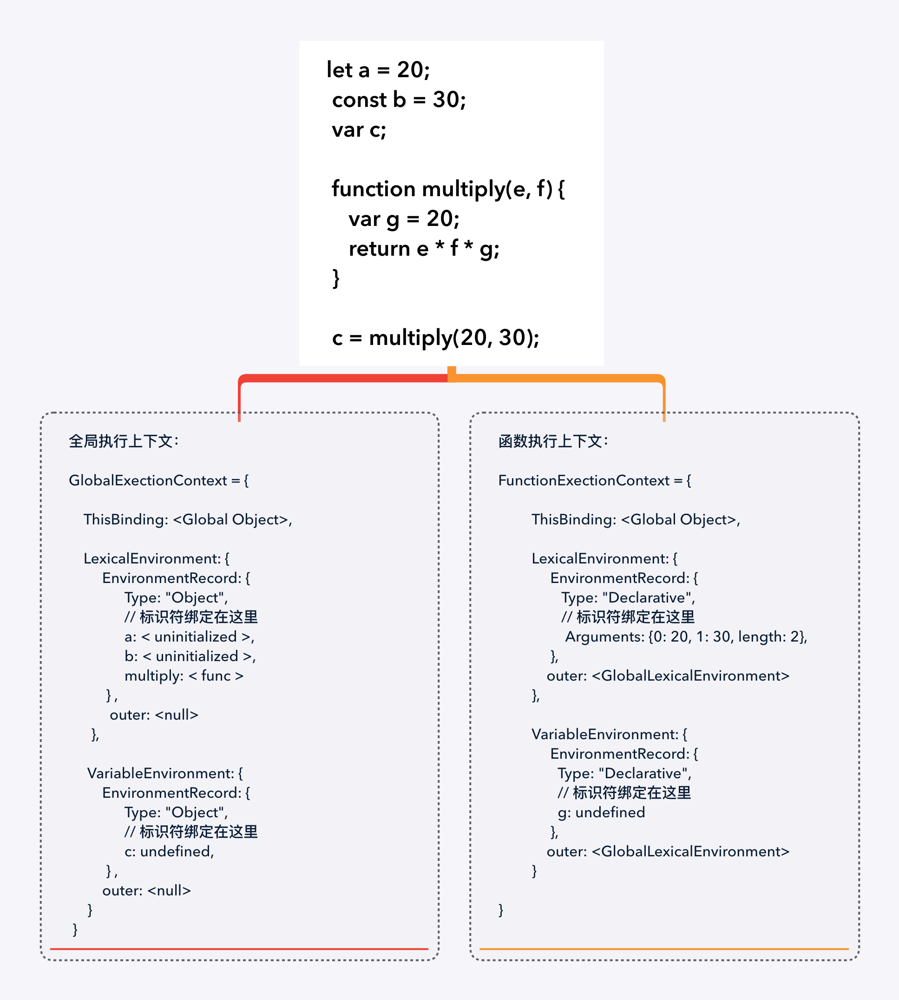

# 深入理解javascript的执行上下文&作用域

## 一、执行上下文的概念

执行上下文就是Javascript代码被解析与执行时所在环境的抽象概念，javascript在运行任何代码时都是在执行上下文中运行的

## 二、执行上下文的类型


## 三、执行栈
  
> 执行栈，在其他的程序语言当中又叫做调用栈，具有后进先出的特性，在javascript当中用来`存储代码在运行过程中所创建的所有执行上下文`。

### 1. JavaScript引擎如何管理执行上下文（执行栈调用过程）

当javascript引擎首次读取你的脚本时，会创建一个`全局执行上下文`,将其push到执行栈的栈中。每当执行一个函数时，就会创建一个新的函数执行上下文push到执行栈的栈顶，引擎会执行在执行栈顶端的上下文，当一个函数执行下文执行完毕之后，执行栈就会释放当前的函数执行上下文，并将控制权移交到下一个执行上下文，一旦所有代码执行完毕，Javascript 引擎把全局执行上下文从执行栈中移除。



### 2. 执行上下文是如何被创建的?

执行上下文分为两个部分，创建过程和执行过程，具体操作如下：

<a data-fancybox title="执行上下文的类型" href="/execution-context-3.png"></a>

#### 在创建阶段中总共发生了三件事情：

1. 确定this值，也就是this bouding
2. 词法环境（LexicalEnvironment）组件被创建，抽象地说，词法环境在伪代码中看起来像这样：
```js
GlobalExectionContext = {  
  LexicalEnvironment: {  
    EnvironmentRecord: {  
      Type: "Object",  
      // 标识符绑定在这里 
      outer: <null>  
    }  
  }
}

FunctionExectionContext = {  
  LexicalEnvironment: {  
    EnvironmentRecord: {  
      Type: "Declarative",  
      // 标识符绑定在这里 
      outer: <Global or outer function environment reference>  
    } 
  } 
}
```
3. 语法环境（VariableEnvironment）组件被创建

**让我们结合一下代码来看看具体的创建过程**



你可能已经注意到了 ```let``` 和 ```const``` 定义的变量没有任何与之关联的值，被标识为``` < uninitialized >```但 var 定义的变量设置为 ```undefined```。

这是因为在创建阶段，代码会被扫描并解析变量和函数声明，其中函数声明存储在环境中，而变量在 var 的情况下会被设置为 undefined,在 let 和 const 的情况下保持未初始化

这就是为什么你可以在声明之前访问 var 定义的变量（尽管是 undefined ），但如果在声明之前访问 let 和 const 定义的变量就会提示引用错误的原因。

这就是我们所谓的`变量提升`。

当函数被激活，那么一个`活动对象(activation object)`就会被创建并且分配给执行上下文。活动对象由特殊对象 arguments 初始化而成。随后，他被当做变量对象(variable object)用于变量初始化。
用代码来说明就是：

```js
function a(name, age){
    var gender = "male";
    function b(){}
}
a(“k”,10);
```

a被调用时，在a的执行上下文会创建一个活动对象AO，并且被初始化为 AO = [arguments]。随后AO又被当做变量对象(variable object)VO进行变量初始化,此时 VO = [arguments].concat([name,age,gender,b])。

#### 执行过程

代码执⾏阶段主要的⼯作是：1、分配变量、函数的引⽤，赋值。2、执⾏代码。

注： 在执行阶段，如果 Javascript 引擎在源代码中声明的实际位置找不到 let 变量的值，那么将为其分配 undefined 值。

## 四、作⽤域

### 作⽤域

js中有全局作⽤域、函数作⽤域，es6中⼜增加了块级作⽤域。作⽤域的最⼤⽤途就是隔离变量或函 数，并控制他们的⽣命周期。作⽤域是在函数执⾏上下⽂创建时定义好的，不是函数执⾏时定义的。

### 作⽤域链

当⼀个块或函数嵌套在另⼀个块或函数中时，就发⽣了作⽤域的嵌套。在当前函数中如果js引擎⽆法找 到某个变量，就会往上⼀级嵌套的作⽤域中去寻找，直到找到该变量或抵达全局作⽤域，这样的链式 关系就称为作⽤域链(Scope Chain)

```js
function a () { 
    return function b() { 
        var myname = 'b'; 
        console.log(myname); // b 
    } 
}
function c() { 
    var myname = 'c'; 
    b(); 
}

var b = a();

c();

// 此时具有两条函数作用域链为：
// b函数作用域链 myname = 'b' -> window
// c函数的作用域链 myname = 'c' -> window

// 所以输出b

// 去掉函数b中的myname声明后 
function a () { 
    return function b() { 
        // var myname = 'b';
        console.log(myname); // 这⾥会报错 
    } 
}

function c() { 
    var myname = 'c'; 
    b(); 
}

var b = a(); 
c(); 

// 此时具有两条函数作用域链为：
// b函数作用域链 window
// c函数的作用域链 myname = 'c' -> window

// myname is not defined

```

## 五、with语句

说到作用域链，不得不说with语句。with语句主要用来临时扩展作用域链，将语句中的对象添加到作用域的头部。

```js
person={ name: "yhb", age: 22, height: 175, wife:{ name: "lwy", age: 21 } };
with(person.wife){
  console.log(name);
}
```
with语句将person.wife添加到当前作用域链的头部，所以输出的就是：“lwy"

with语句结束后，作用域链恢复正常

## 六、面试题

1. 请给出下面的输出结果

```js
function foo () { console.log('foo1') }
foo()
function foo() { console.log('foo2') }
foo()
```
答案： foo2 foo2

答案解析： JavaScript 引擎并非一行一行地分析和执行程序，而是一段一段地分析执行，当执行一段代码的时候，会进行一个“准备工作”，具有变量提升和函数提升。

2. 给出下面的输出结果

```js
var scope = "global scope";
function checkscope(){
 var scope = "local scope";
 function f(){
    return scope;
 }
 return f();
}
checkscope();

var scope = "global scope";
function checkscope(){
  var scope = "local scope";
  function f(){
    return scope;
  }
  return f;
}
checkscope()();
```
答案： local scope、 local scope

答案解析:

JavaScript 函数的执行用到了作用域链，这个作用域链是在函数定义的时候创建的。嵌套的函数 f() 定义在这个作用域链里，其中的变量 scope 一定是局部变量，不管何时何地执行函数 f()，这种绑定在执行 f() 时依然有效。

这两段代码的执行结果是一致的，但是执行上下文栈的变化不一样。

A: contextStack = [globalContext] ---> contextStack = [checkscopeContext, globalContext] ---> contextStack = [fContext, checkscopeContext, globalContext] ---> contextStack = [checkscopeContext, globalContext] ---> contextStack = [globalContext]

B: contextStack = [globalContext] ---> contextStack = [checkscopeContext, globalContext] ---> contextStack = [fContext, globalContext] ---> contextStack = [globalContext]

3. 总结一下函数执行上下文中作用域链和变量对象的创建过程

```js
var scope = "global scope";
function checkscope(){
 var scope = "local scope";
 function f(){
    return scope;
 }
 return f();
}
checkscope();
```
+ 1. checkscope 函数被创建，保存作用域链到 内部属性[[scope]]
```js
checkscope.[[scope]] = [
  globalContext.VO
];
```
+ 2. 执行 checkscope 函数，创建 checkscope 函数执行上下文，checkscope 函数执行上下文被压入执行上下文栈
```js
ECStack = [
  checkscopeContext,
  globalContext
];
```
+ 3. checkscope 函数并不立刻执行，开始做准备工作，第一步：复制函数[[scope]]属性创建作用域链
```js
checkscopeContext = {
  Scope: checkscope.[[scope]],
}
```
+ 4. 第二步：用 arguments 创建活动对象，随后初始化活动对象，加入形参、函数声明、变量声明
```js
checkscopeContext = {
  AO: {
    arguments: {
      length: 0
    },
    scope2: undefined
  }，
  Scope: checkscope.[[scope]],
}
```
+ 5. 第三步：将活动对象压入 checkscope 作用域链顶端

```js
checkscopeContext = {
  AO: {
    arguments: {
      length: 0
    },
    scope2: undefined
  },
  Scope: [AO, [[Scope]]]
}
```
+ 6. 准备工作做完，开始执行函数，随着函数的执行，修改 AO 的属性值
```js
checkscopeContext = {
  AO: {
    arguments: {
      length: 0
    },
    scope2: 'local scope'
  },
  Scope: [AO, [[Scope]]]
}
```
+ 7. 查找到 scope2 的值，返回后函数执行完毕，函数上下文从执行上下文栈中弹出
```js
ECStack = [
  globalContext
];
```