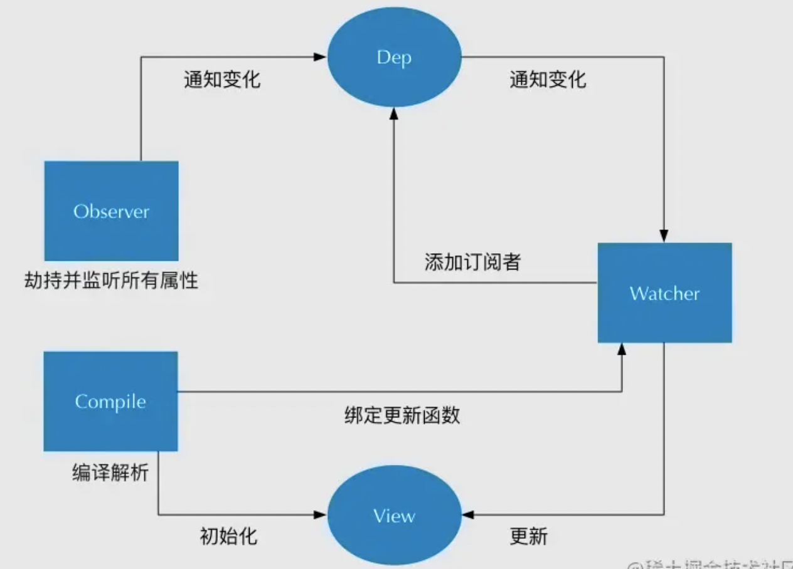

# 响应式相关的面试题

## 一、 直接给一个数组项赋值，Vue 能检测到变化吗？

数组考虑性能原因没有用defineProperty对数组的每一项进行拦截，而是选择重写数组（push,shift,pop,splice,unshift,sort,reverse）方法进行重写。

在Vue中修改数组的索引和长度是无法监控到的。需要通过以上7种变异方法修改数组才会触发数组对应的watcher进行更新。数组中如果是对象数据类型也会进行递归劫持。

如果想更改索引更新数据, 可以通过Vue.$set()来进行处理, 其核心内部用的是splice方法

针对修改数组的长度使用**vm.items.splice(newLength)**解决

快速Mock:

```js
let state = [1,2,3];
let originArray = Array.prototype;
let arrayMethods = Object.create(originArray);

function defineReactive(obj) {
    arrayMethods.push = function (...args) {
        originArray.push.call(this,...args);
        render();
    }
    obj.__proto__ = arrayMethods;
}
defineReactive(state);

function render(){
    app.innerHTML = state;
}
render();
state.push(4)
```

## 二、请说一下响应式数据的理解？（Vue的响应式原理）

在vue2当中，对象内部通过defineReactive方法，使用Object.defineProperty将属性进行劫持（只会劫持已经存在的属性），多层对象是通过递归来实现劫持，数组则是通过重写数组方法来实现。内部依赖收集是由于每个属性都拥有自己的dep属性，存放他所依赖的watcher，当属性变化后会通知自己对应的watcher去更新，所以如果对象层级过深，性能就会差；
在实际的使用过程中不需要响应数据的内容不要放到data中，也可以使用Object.freeze() 去冻结数据

**通过以上两点可以发现Vue中的缺陷:**

+ 对象默认只监控自带的属性，新增的属性响应式不生效 (层级过深，性能差)
+ 数组通过索引进行修改 或者 修改数组的长度，响应式不生效
  
为了解决以上问题，vue提供来额外的API：

```js
vm.$set(vm.arr,0,100); // 修改数组内部使用的是splice方法 
vm.$set(vm.address,'number','6-301'); // 新增属性通过内部会将属性定义成响应式数据        
vm.$delete(vm.arr,0);  // 删除索引，属性
```

在vue3当中则是使用proxy来实现响应式数据

快速mock

```js
let state = { count: 0 };
// app.innerHTML = state.count;

// 1.将数据变成响应式数据
let active;
function defineReactive(obj) {
    for (let key in obj) {
        let value = obj[key];
        let dep = [];
        Object.defineProperty(obj, key, {
            get() {
                if (active) {
                    dep.push(active);
                }
                return value;
            },
            set(newValue) {
                value = newValue;
                dep.forEach(fn => fn());

            }
        });
    }
}
defineReactive(state);
const watcher = (fn) => {
    active = fn;
    fn();
    active = null;
}
watcher(() => {
    app.innerHTML = state.count;
});
watcher(() => {
    console.log(state.count)
});
```

## 三、怎么理解vue的单向数据流？

所有的prop都会使其父子prop之间形成一个单向下行绑定：父级prop的更新会向下流动到子组件中，但是反过来不行。这样会防止从子组件意外的改变父组件的状态，从而导致你的应用的数据流向难以理解

额外的，每次父级组件发生更新时，子组件中所有的 prop 都将会刷新为最新的值。子组件想修改时，只能通过 $emit 派发一个自定义事件，父组件接收到后，由父组件修改

## 四、什么是数据的丢失?

如果在初始化时没有定义数据，之后更新的数据是无法触发页面渲染更新的，这部分数据是丢失的数据，这种现象叫数据的丢失。

## 五、Vue 是如何实现数据双向绑定的？

Vue 数据双向绑定主要是指：数据变化更新视图，视图变化更新数据

+ 输入框内容变化时，Data 中的数据同步变化。即 View => Data 的变化
  
+ Data 中的数据变化时，文本节点的内容同步变化。即 Data => View 的变化

其中，View 变化更新 Data ，可以通过事件监听的方式来实现，所以 Vue 的数据双向绑定的工作主要是如何根据 Data 变化更新 View。

Vue 主要通过以下 4 个步骤来实现数据双向绑定的：

1. 实现一个监听器 Observer：对数据对象进行遍历，包括子属性对象的属性，利用 Object.defineProperty() 对属性都加上 setter 和 getter。这样的话，给这个对象的某个值赋值，就会触发 setter，那么就能监听到了数据变化。
   
2. 实现一个解析器 Compile：解析 Vue 模板指令，将模板中的变量都替换成数据，然后初始化渲染页面视图，并将每个指令对应的节点绑定更新函数，添加监听数据的订阅者，一旦数据有变动，收到通知，调用更新函数进行数据更新。
   
3. 实现一个订阅者 Watcher：Watcher 订阅者是 Observer 和 Compile 之间通信的桥梁 ，主要的任务是订阅 Observer 中的属性值变化的消息，当收到属性值变化的消息时，触发解析器 Compile 中对应的更新函数。
   
4. 实现一个订阅器 Dep：订阅器采用 发布-订阅 设计模式，用来收集订阅者 Watcher，对监听器 Observer 和 订阅者 Watcher 进行统一管理。



##  六、Proxy 与 Object.defineProperty 优劣对比

1. Proxy 的优势如下:

+ Proxy 可以直接监听对象而非属性；
+ Proxy 可以直接监听数组的变化；
+ Proxy 有多达 13 种拦截方法,不限于 apply、ownKeys、deleteProperty、has 等等是 Object.defineProperty 不具备的；
+ Proxy 返回的是一个新对象,我们可以只操作新的对象达到目的,而 Object.defineProperty 只能遍历对象属性直接修改；
+ Proxy 作为新标准将受到浏览器厂商重点持续的性能优化，也就是传说中的新标准的性能红利；

2. Object.defineProperty 的优势如下:

兼容性好，支持 IE9，而 Proxy 的存在浏览器兼容性问题,而且无法用 polyfill 磨平，因此 Vue 的作者才声明需要等到下个大版本( 3.0 )才能用 Proxy 重写。

## 七、Vue 怎么用 vm.$set() 解决对象新增属性不能响应的问题 ？

受现代 JavaScript 的限制 ，Vue 无法检测到对象属性的添加或删除。由于 Vue 会在初始化实例时对属性执行 getter/setter 转化，所以属性必须在 data 对象上存在才能让 Vue 将它转换为响应式的。但是 Vue 提供了 Vue.set (object, propertyName, value) / vm.$set (object, propertyName, value)  来实现为对象添加响应式属性

## 八、vm.$set 的实现原理

1. 如果目标是数组，直接使用数组的 splice 方法触发相应式；

2. 如果目标是对象，会先判读属性是否存在、对象是否是响应式，最终如果要对属性进行响应式处理，则是通过调用   defineReactive 方法进行响应式处理（ defineReactive 方法就是  Vue 在初始化对象时，给对象属性采用 Object.defineProperty 动态添加 getter 和 setter 的功能所调用的方法）

## 九、手写实现vm.$set

## 十、手写EventEmitter，实现on/emit/off方法。

## 十一、vue的构造函数为什么没有使用class语法糖

主要还是因为vue构造函数的方法很多，如果使用class进行维护会篇幅很大，对于重写方法的行为也不是很友好，所以还是采用了构造函数的方式，在其原型上增加方法进行拓展

## 十二、 在data上面定义了一个$name属性，可以通过Vue.$name拿到吗？

不可以，因为vue内部将所有$开头的属性都默认为是vue本身内置的属性

## 十三、给响应式数据添加标识为什么不可以直接使用value.__ob__ = this?

因为value是一个被观测得响应式的值，如果这样赋值就会触发Object.defineProperty方法的set方法，此时无限递归会陷入死循环

通过`Object.defineProperty`方法添加`__ob__`属性，这个属性是不能被枚举不能被循环出来的，所以不会有影响

## 十四、定义响应式数据的时候在defineReactive的set方法内部，不直接value[key]赋值？

会陷入死循环